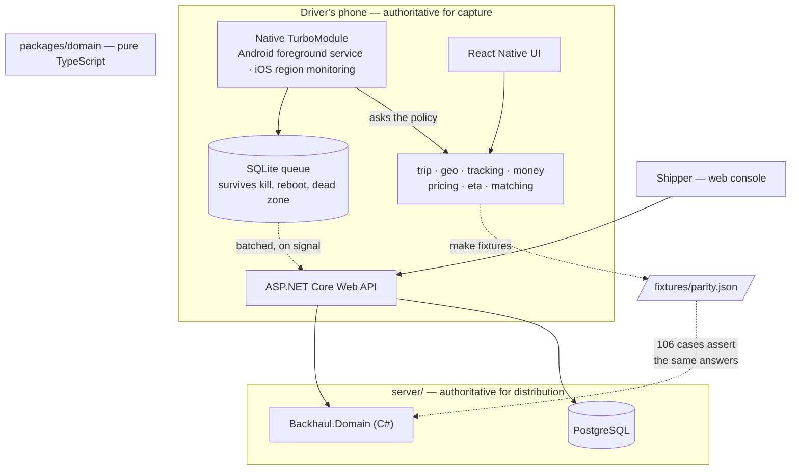
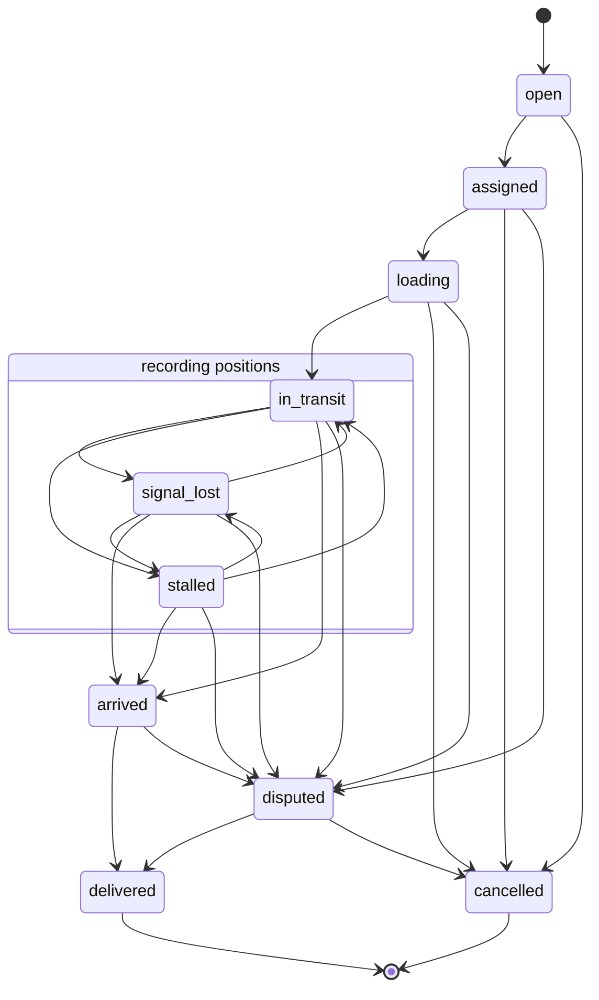
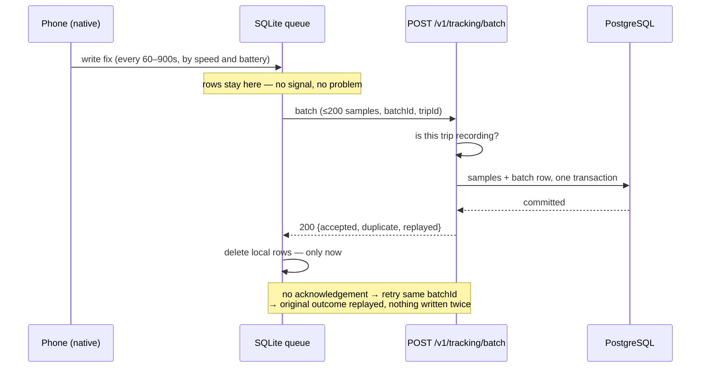

# Backhaul

**Truck load matching and freight visibility for Nigerian road logistics.**

A 30-tonne truck leaves Lagos loaded and arrives in Kano three days later. It
unloads. Then, very often, it drives 1,000 km back **empty**. The fuel is
burned, the driver is paid, the tyres wear — and no revenue is earned against
any of it. That cost is priced into the outbound leg, which is why Nigerian
freight rates are high relative to distance.

Backhaul is a two-sided freight platform with tracking as its spine: post a
load, take bids from verified carriers, watch the cargo move, prove the
delivery — and, as a truck nears its destination, surface the loads going back
the other way.

> **Tracking is the wedge; matching is the business.**
>
> A marketplace with no liquidity is worth nothing to either side. Tracking is
> worth paying for with one truck, one trip and no other user on the platform,
> because it answers an acute present anxiety: *where are my goods right now?*
> Every tracked trip then teaches the platform a corridor, a truck, a driver
> and a timing pattern — precisely the data the matching engine needs, and
> precisely the data a cold-start freight marketplace does not have.

Full analysis in [`docs/00-PRODUCT-STATEMENT.md`](docs/00-PRODUCT-STATEMENT.md).

---

## Contents

1. [Where this is](#1-where-this-is)
2. [What is built](#2-what-is-built)
3. [How it fits together](#3-how-it-fits-together)
4. [The trip](#4-the-trip)
5. [The ingest path](#5-the-ingest-path)
6. [Two languages, one set of answers](#6-two-languages-one-set-of-answers)
7. [Correctness notes](#7-correctness-notes)
8. [Running it](#8-running-it)
9. [The gates](#9-the-gates)
10. [What is deliberately missing](#10-what-is-deliberately-missing)
11. [Documents](#11-documents)

---

## 1. Where this is

**Phase 0 — Foundation.** The domain and the server are built and tested.
**There are no screens yet**, and nothing here has been looked at by a person.

| | |
|---|---|
| Domain tests | **136** passing |
| Server parity cases | **106** passing |
| Server endpoint tests | **16** passing |
| Verified against real PostgreSQL | yes, including a process restart |
| Authentication | **none** — see §10 |
| Screens | none |

Phase gates and what finishes each one: [`docs/ROADMAP.md`](docs/ROADMAP.md).

---

## 2. What is built

### `packages/domain` — pure TypeScript

No React Native, no DOM, no I/O, no clock, no randomness. Enforced by lint
(ADR-0001) and by `scripts/boundary-check.sh`, which injects a violation and
fails if the rule stays quiet.

| Module | Decides |
|---|---|
| `trip.ts` | Whether a trip may change state, and refuses with a sentence a driver can read |
| `geo.ts` | Which position fixes are worth believing, and what was discarded |
| `tracking.ts` | How often to sample, when to upload, when silence means something |
| `money.ts` | Integer kobo, displayed in whole naira |
| `pricing.ts` | Indicative rates, demurrage, settlement |
| `eta.ts` | An arrival window, or a refusal with a reason |
| `matching.ts` | Which load a carrier should take, and whose bid a shipper should accept |

### `server/` — ASP.NET Core on .NET 9

EF Core against PostgreSQL, Swagger generated from the controllers' own XML
comments. Trips, the ingest path, cleaned tracks, pricing and settlement.

Details: [`server/README.md`](server/README.md).

---

## 3. How it fits together



**The device is authoritative for capturing and preserving a position; the
server is authoritative for distributing it.** A truck driving through 400 km
of dead zone loses nothing — the samples are on the phone, in order, and they
arrive complete when signal returns.

---

## 4. The trip

The state machine is written as **data, not control flow** — an explicit edge
set that a test asserts exactly, so adding a transition fails the build rather
than quietly permitting a new way for cargo to change hands.



Three things in that diagram are deliberate and easy to get wrong:

- **The three transit states move freely between one another.** Signal and
  movement come and go on a Lagos–Kano corridor several times a trip, and each
  drop must not need a human to un-stick it.
- **`signal_lost` still records.** Stopping capture when the network drops
  loses precisely the stretch of road nobody can account for afterwards.
- **A dispute never returns to the road.** Resolution is a human decision
  recorded as an event, never inferred from tracking data — the reason a trip
  is disputed is that the tracking data is being argued about. A resumed trip
  is a new trip.

The history is **append-only**. No update path, no delete path; a correction is
a new event and the original survives (ADR-0003).

---

## 5. The ingest path

The one endpoint with a contract that cannot be relaxed.



- **Acknowledges only once committed, never optimistically.** The device
  deletes its local rows on that acknowledgement and on nothing else. Making
  this endpoint faster by responding earlier does not make it faster; it makes
  it destroy the evidence the product exists to keep.
- **The batch row and the samples commit together.** Written separately, a
  crash between them acknowledges a batch whose samples were never stored.
- **Duplicate delivery is expected**, not exceptional. Samples deduplicate on
  their client-generated id, which is the primary key, so a repeat is a no-op
  by construction.
- **Samples are stored exactly as sent.** Fixes the phone could not vouch for
  are excluded when a track is *read*, where what was excluded is shown beside
  the figure it was excluded from. A server that quietly discards fixes
  destroys the evidence a driver needs to argue with their invoice.
- **There is no off-trip tracking.** The server rejects samples for a trip that
  is not under way rather than trusting the client not to send them.

Verified rather than asserted: an acknowledged batch, its trip and its history
survive a process restart against real PostgreSQL, and replaying that batch
afterwards returns the original outcome and writes nothing.

---

## 6. Two languages, one set of answers

The server is .NET; the domain is TypeScript. Every rule that exists on both
sides therefore exists **twice**, and two implementations of a demurrage rule
is two answers to give a shipper.

`packages/domain` is the source of truth. `make fixtures` regenerates
`fixtures/parity.json` from it, and the C# suite asserts the same answers:

| Covered | Cases |
|---|---|
| Trip machine — complete edge set, terminal and tracking flags | 24 transitions, 10 states |
| Refusal messages, **word for word** | 5 |
| Time-in-state arithmetic | 3 |
| Quotes across four real corridors × five truck classes | 20 |
| Demurrage, including boundary minutes | 30 |
| Settlement, on deliberately awkward figures | 7 |
| Percentage rounding, both signs | 10 |
| Truck classing at capacity boundaries | 11 |
| Haversine distances between real cities | 10 |
| Track cleaning outcomes | 5 |
| Stall and silence detection | 7 |

`make fixtures-check` fails the build on stale fixtures, so forgetting to
regenerate surfaces as *"you forgot a step"* rather than *"the server is
broken"*. Full argument: [ADR-0005](docs/adr/0005-the-server-is-dotnet-and-parity-is-a-test.md).

---

## 7. Correctness notes

The defects worth recording are the ones a green test suite did not catch.

**Pricing was wrong by a factor of five, and only a real route showed it.**
Rates were per tonne-kilometre — how freight is costed in most of the world,
and not how anybody in Nigerian haulage talks. The arithmetic was clean, the
tests were green, and it quoted **₦398,400 for a Lagos–Kano trailer run** that
goes for something over two million naira. What caught it was a test asserting
a range *a haulier would recognise*, against a real 830 km corridor, rather
than a range the formula would produce.

**Bid ranking handed every load to the cheapest bidder.** Price was scored by
position within the spread of bids received, so with two bids of ₦1,800,000 and
₦2,000,000 the dearer scored *zero* — as though infinitely expensive — because
it happened to top a two-bid range. A carrier with 2 on-time trips out of 6
beat one with 39 out of 40, which is the exact failure the ranking exists to
prevent. Now a proportional premium over the cheapest.

**A dropped fix used to take the rest of the leg with it.** The cleaner
rejected a cell-tower fix that snapped 800 km across the country, then compared
the *next* good fix against the bad one, decided that was an implausible jump
too, and kept going. A rejected fix is no longer the baseline for the next.

**A parked truck can drift into movement.** Two fixes of a stationary truck,
each accurate to ±90 m, sit 180 m apart. Counted as travel, an overnight stop
invents kilometres onto a per-kilometre rate. Movement now has to clear the
combined uncertainty of both fixes.

**The two implementations disagreed on a timestamp.** TypeScript writes
`2026-03-04T06:20:00.000Z`; .NET's round-trip format writes
`2026-03-04T06:20:00.0000000+00:00`. Both parse, both are ISO 8601, and a
driver would have seen a different sentence depending on which system answered.
Caught by the parity fixture comparing refusal wording character for character
— which felt excessive when it was written. The same bug was then found in
every response body, **by reading a response rather than by a test.**

**A Swagger annotation was lying.** An endpoint documented as returning 200
actually returned 201. Nothing was broken; the generated contract was simply
wrong about the API it described, which is worse than no contract because it is
trusted.

---

## 8. Running it

```bash
make setup          # install
make ci             # everything: gates, domain tests, server tests
```

The server, on an in-memory store — no database needed, Swagger at `/swagger`:

```bash
make server-run
```

Against real PostgreSQL, in Docker:

```bash
make server-up      # http://localhost:8080/swagger
make server-down    # and drop its scratch database
```

The .NET SDK is installed per-user at `~/.dotnet` and is not on a default
PATH; the Makefile's `DOTNET` variable points at it and is overridable for CI.

---

## 9. The gates

`make gates` runs the blocking checks. Three of them exist because something
was missed, not in anticipation of it:

| Gate | Catches |
|---|---|
| `make typecheck` | TypeScript, strict, with `noUncheckedIndexedAccess` and `exactOptionalPropertyTypes` |
| `make lint` | The domain purity boundary, and reading the clock |
| `make boundary` | **The purity rule having silently stopped matching** — injects a violation and fails if lint stays quiet |
| `make doc-check` | A required document missing, malformed, **or present on disk and untracked by git** |
| `make fixtures-check` | **Fixtures stale after a rule changed on the TypeScript side** |
| `make server-test` | 106 parity cases, 16 endpoint tests |

The doc gate's git-tracked check exists because a sibling project had a
document written, committed with a message saying so, and absent from GitHub
for a day — `docs/*` is an allow-list and `git add` had nothing to add.

---

## 10. What is deliberately missing

- **Authentication.** No OTP, no JWT, no device binding. Anyone who knows a
  trip id can post positions to it. The API is not exposed anywhere and must
  not be until phase 3. This blocks phase 2's pilot and currently has no phase
  of its own in the roadmap — it needs one.
- **Screens.** Nothing in this product has been looked at by a person, and the
  clearest lesson from the sibling project is that the worst defects are
  invisible to a green test suite and surface only from rendered output. There
  are no screenshots in this README for that reason.
- **Corridor-segmented ETA.** What exists is the fallback tier — pace from the
  trip's own track, or a class average, marked as modelled either way. The
  empirical model needs a corpus of completed trips; building it now would
  produce a model fitted to nothing, dressed in the authority of a
  distribution. See [`docs/FEATURE-BACKLOG.md`](docs/FEATURE-BACKLOG.md).
- **The marketplace.** Loads, bids and awards. The ranking engines are written
  and tested; nothing surfaces them.
- **PostGIS.** In the compose image, unused. The first geometry column arrives
  with load search in phase 5.
- **Bulk ingest.** Samples insert row by row. The Redis buffer and bulk `COPY`
  in the backend spec matter at ~850,000 samples a day; at pilot volume they
  would be a premature complication.

---

## 11. Documents

| Document | Answers |
|---|---|
| [`docs/00-PRODUCT-STATEMENT.md`](docs/00-PRODUCT-STATEMENT.md) | Why this exists |
| [`docs/ROADMAP.md`](docs/ROADMAP.md) | Where the work is, and what finishes each phase |
| [`docs/JOURNAL.md`](docs/JOURNAL.md) | What we did, and what surprised us |
| [`docs/adr/`](docs/adr/) | Why it is built this way |
| [`docs/FEATURE-BACKLOG.md`](docs/FEATURE-BACKLOG.md) | What is missing, why, and what would unblock it |
| [`CHANGELOG.md`](CHANGELOG.md) | What changed for someone using this |
| [`CLAUDE.md`](CLAUDE.md) | How to work in this repository |
| [`DESIGN.md`](DESIGN.md) | Colour, type, targets, voice |
| [`server/README.md`](server/README.md) | The API in detail |
