# Backhaul

**Truck load matching and freight visibility for Nigerian road logistics.**

A 30-tonne truck leaves Lagos loaded and arrives in Kano three days later. It
unloads. Then, very often, it drives 1,000 km back **empty**. The fuel is
burned, the driver is paid, the tyres wear — and no revenue is earned against
any of it. That cost is priced into the outbound leg, which is why Nigerian
freight rates are high relative to distance.

Backhaul is a two-sided freight platform with tracking as its spine: post a
load, take bids from verified carriers, watch the cargo move, prove the
delivery — and, as a truck nears its destination, surface the loads going back
the other way.

> **Tracking is the wedge; matching is the business.**
>
> A marketplace with no liquidity is worth nothing to either side. Tracking is
> worth paying for with one truck, one trip and no other user on the platform,
> because it answers an acute present anxiety: *where are my goods right now?*
> Every tracked trip then teaches the platform a corridor, a truck, a driver
> and a timing pattern — precisely the data the matching engine needs, and
> precisely the data a cold-start freight marketplace does not have.

Full analysis in [`docs/00-PRODUCT-STATEMENT.md`](docs/00-PRODUCT-STATEMENT.md).

---

## Contents

1. [Where this is](#1-where-this-is)
2. [What is built](#2-what-is-built)
3. [The app](#3-the-app)
4. [How it fits together](#4-how-it-fits-together)
5. [The trip](#5-the-trip)
6. [The ingest path](#6-the-ingest-path)
7. [Two languages, one set of answers](#7-two-languages-one-set-of-answers)
8. [Correctness notes](#8-correctness-notes)
9. [Running it](#9-running-it)
10. [The gates](#10-the-gates)
11. [What is deliberately missing](#11-what-is-deliberately-missing)
12. [Documents](#12-documents)

---

## 1. Where this is

**Phase 0 is complete.** Its exit gate is green: the domain package is
importable by consumers that are not React Native, the boundary rule is proven
to fire, both platforms build in CI on every push, and the app has been walked
through on a device — which is where most of the defects in §8 were found.

**Phase 1 is under way, and it is the long pole**: the native tracking loop.
Its first exit gate — *zero position loss across a simulated 1,000 km
airplane-mode trip* — is **met in software** (ADR-0009). The other two need a
physical Transsion handset and no simulation stands in for them.

| | |
|---|---|
| Domain tests | **176** passing |
| Server parity cases | **106** passing |
| Server endpoint tests | **16** passing |
| App tests | **33** passing |
| Verified against real PostgreSQL | yes, including a process restart |
| Screens | shipper, carrier and driver faces, both themes, iOS and Android |
| Authentication | bearer tokens; authorisation filtered at the query layer |
| Server tests | **27** endpoint tests, 11 of them authorisation |

Phase gates and what finishes each one: [`docs/ROADMAP.md`](docs/ROADMAP.md).

---

## 2. What is built

### `packages/domain` — pure TypeScript

No React Native, no DOM, no I/O, no clock, no randomness. Enforced by lint
(ADR-0001) and by `scripts/boundary-check.sh`, which injects a violation and
fails if the rule stays quiet.

| Module | Decides |
|---|---|
| `trip.ts` | Whether a trip may change state, and refuses with a sentence a driver can read |
| `geo.ts` | Which position fixes are worth believing, and what was discarded |
| `tracking.ts` | How often to sample, when to upload, when silence means something |
| `money.ts` | Integer kobo, displayed in whole naira |
| `pricing.ts` | Indicative rates, demurrage, settlement |
| `eta.ts` | An arrival window, or a refusal with a reason |
| `matching.ts` | Which load a carrier should take, and whose bid a shipper should accept |
| `queue.ts` | What may be deleted from the phone, and when |
| `stops.ts` | Every stop on a trip, and how long it lasted |
| `utilisation.ts` | How much of a fleet's driving was paid for |

### `apps/mobile` — the three faces

Three faces in one binary, consuming the domain package directly. See §3.

### `server/` — ASP.NET Core on .NET 9

EF Core against PostgreSQL, Swagger generated from the controllers' own XML
comments. Trips, the ingest path, cleaned tracks, pricing and settlement.

Details: [`server/README.md`](server/README.md).

---

## 3. The app

TypeScript strict, consuming `@backhaul/domain` directly — the screens render
decisions they did not make.

**Three faces, one binary.** They are not the same product with different data:
a driver did not choose this app, is paid whether or not they use it, and is
reading it in a moving cab, so the driver face is one screen with one action at
64 dp targets. The shipper and fleet faces are dense and scannable at 48.

### Starting it

| The icon, on a busy home screen | The launch screen | The app's own splash |
|---|---|---|
|  |  |  |

A truck with the load coming *back* through it — the whole product in one
shape, filled rather than stroked because the app's own 1.75 px line family
disappears at 40 px on a launcher with a photograph behind it. Generated by
`scripts/make-icons.py` from the same accent the app uses, at every density
both platforms ask for, so the icon and the product cannot drift apart.

The launch screen the system draws and the splash the app draws are the same
blue with the same mark in the same place, so the hand-over between them is
invisible. The template's version said "BackhaulApp" in 36 pt over "Powered by
React Native", on white — an Xcode target name, an advertisement, and a white
flash before a blue app.

Nothing on the splash is a spinner. It is on screen for the second a cold start
takes on the handsets this is built for, which is long enough for one idea, and
it leaves when the app is ready *and* the mark has been up long enough to be
seen — a splash that departs the frame it completes reads as a glitch.

### The shipper

| Trips | A trip |
|---|---|
| 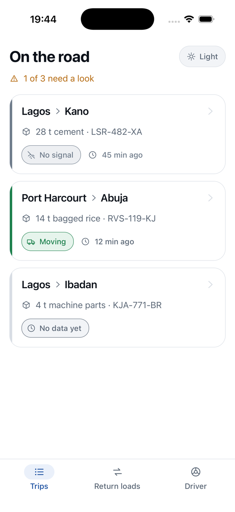 | 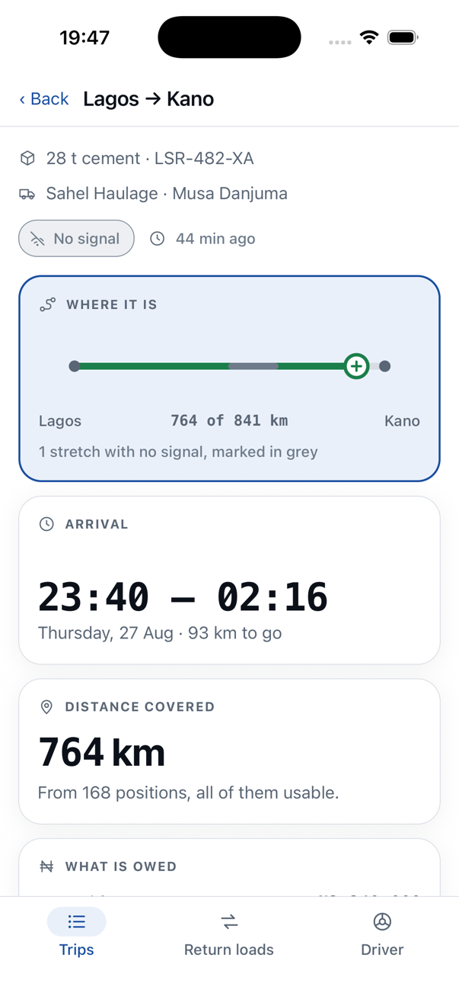 |

The list is scanned down a colour rail, and every row carries the state as an
icon, a word and a tint — never colour alone, because it is read in sunlight
through a windscreen. The header says whether anything needs a person at all,
which is usually "no" and is worth saying rather than making someone read six
rows to work out.

The trip screen leads with **where it is**: the corridor drawn to scale, with
the truck's measured progress along it and the stretches with no signal marked
grey *in the position they happened*. It is not a map and does not pretend to
be one — see [ADR-0006](docs/adr/0006-the-corridor-view-is-not-a-map.md).

Two rules are visible on it and both are load-bearing:

- **Distance never appears without the share of fixes it was computed from.**
  "From 168 positions, all of them usable" sits under the figure, and when
  fixes were discarded it says how many and why.
- **The ETA is a range, and a refusal when the evidence is thin.** A single
  time reads as a promise; the domain's own sentence is rendered instead of a
  dash.

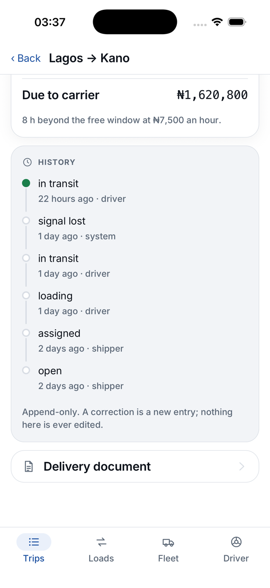

The history is append-only, and it says so on the screen rather than only in an
ADR. Every settlement line is whole naira, so the column adds up on screen as
well as in the arithmetic.

### Showing somebody else where their goods are

**This is the wedge.** Tracking one truck is worth paying for with no other
user on the platform — but only if the person who wants to *see* it can, and
that person is usually a cargo owner who has never heard of Backhaul and will
not install anything to find out where their load is.

| Sharing a trip | The links on it |
|---|---|
| 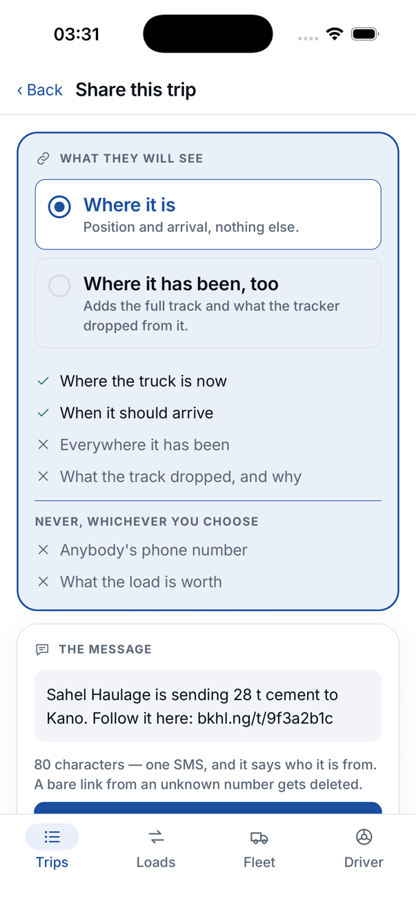 | 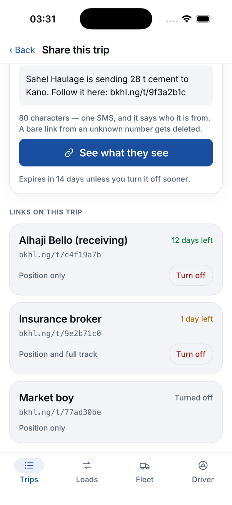 |

Two decisions and nothing else: what the link shows, and how long it lasts.
What it will **never** show is below a rule, separated from the toggle, because
no scope turns those on and the sentence that actually gets a link sent is *it
cannot show them your number*.

Every link expires — fourteen days by default. A link with no expiry is a
permanent, unauthenticated view of where somebody's truck is, which is a thing
worth stealing. Revoked and expired are answered separately, in different
words: telling a cargo owner their link "was turned off" when it merely lapsed
invites a phone call about trust.

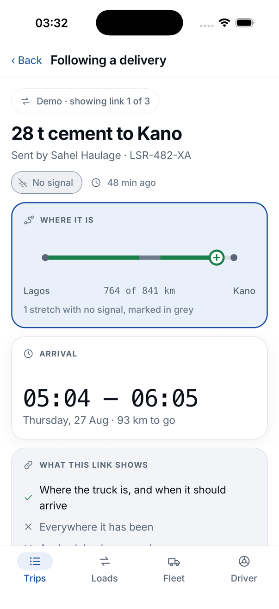

No account, no install, no navigation. One thing on the screen, and the ask is
at the bottom *after* the answer has been given.

### When the argument starts

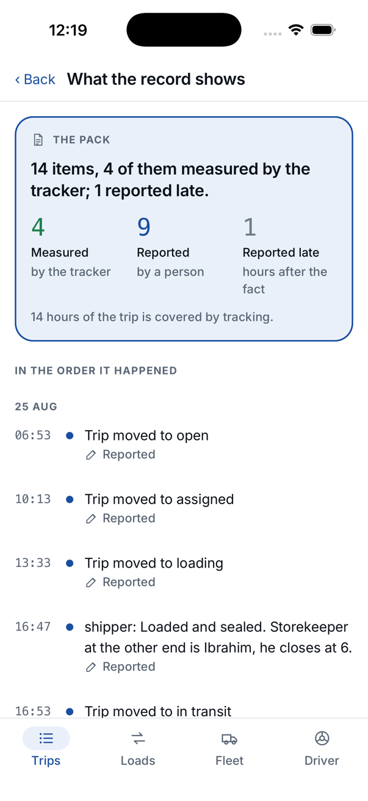

Everything the trip recorded, in the order it happened, each item marked as
**measured by the tracker**, **reported by a person**, or **reported late**.
The pack adds nothing and decides nothing — a platform that adjudicates its own
disputes is one both sides stop trusting.

Getting it honest took three passes over the same screen. It first reported
*fifty-one hours of missing evidence* on a trip whose coverage was continuous,
because it read a run of position fixes as a series of instants; then it
counted the quiet before the truck loaded as a hole; then it treated a
signal-loss event — measured, but the very absence of coverage — as though it
were coverage. The engine now measures how much of the trip is *covered*, which
is what the question was always about.

### The conversation, attached to the trip

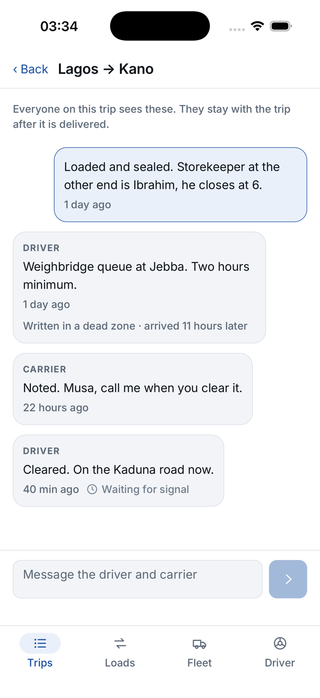

Today this happens in a WhatsApp group with forty other messages in it, and
when a delivery is argued about the argument is reconstructed from a phone that
has since been sold.

The screen's hard job is being honest about **time**. A message written in a
dead zone and delivered eleven hours later says both, or it misrepresents
whoever wrote it — and a message the server has not taken says "waiting for
signal" rather than claiming to be sent.

### When something goes wrong

| Reporting from the roadside | Proof of delivery |
|---|---|
| 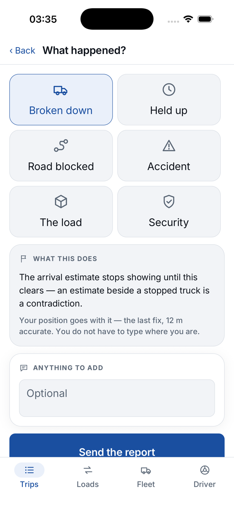 | 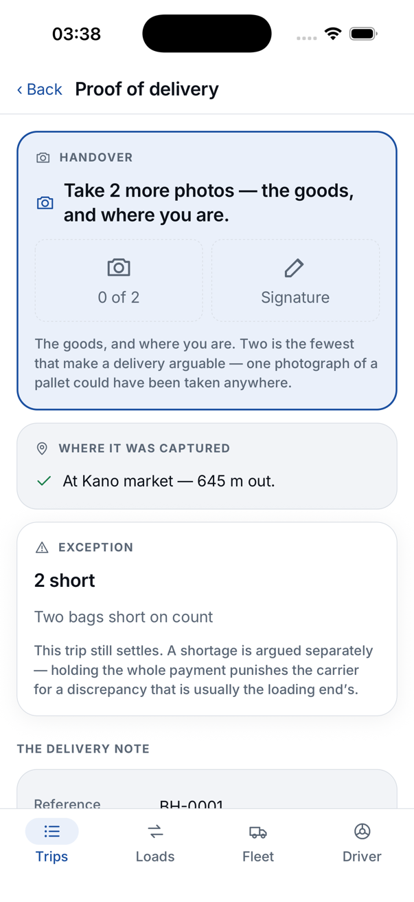 |

The report is **one tap to file**: the kind carries a default severity, the
position comes from the tracker, and everything else is optional. A form that
demands a classification before it will accept a report is a form that produces
no reports. A photograph is required for cargo and accident claims and never
for a security one — nobody photographs a hijack, and demanding it would mean
the report that matters most is the one that cannot be filed.

Proof is two photographs, a signature, a name and where the phone was. A
capture more than a kilometre from the destination is **flagged on the
document, not refused**: a market address in Kano is a district, not a gate, and
a driver who cannot close a delivery they actually made stops using the app
before the day is out.

| Drops | Payment milestones |
|---|---|
| 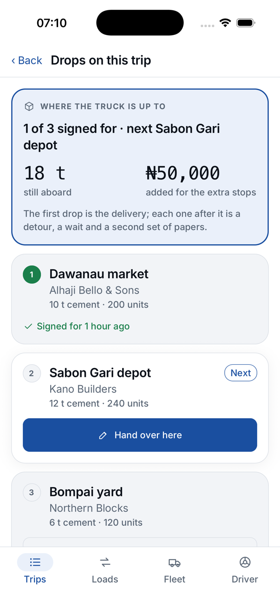 | 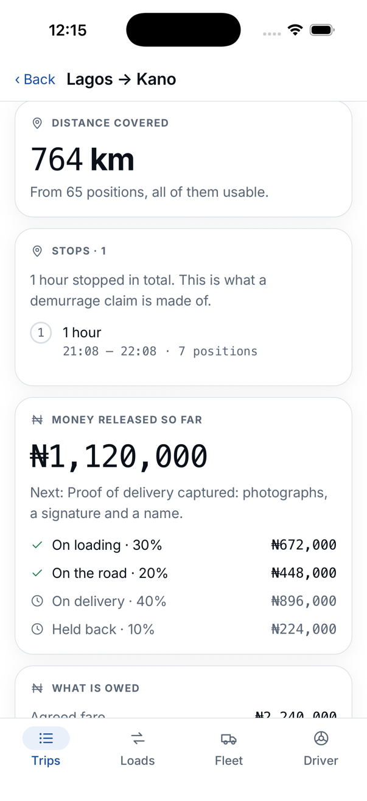 |

One truck, several deliveries, in the order the trailer was loaded — the last
drop is at the front of the box, so a route that reorders them requires
emptying the whole thing at the first stop. The trip finishes on the last
signature, not on arriving at the last address.

Money moves against conditions the platform can **verify from evidence it
already holds**: 30% when loading starts, 20% after six hours of arriving
positions, 40% on the *proof* of delivery rather than on somebody saying the
trip is done, and 10% held for a week against a shortage.

| The delivery note | Afterwards |
|---|---|
| 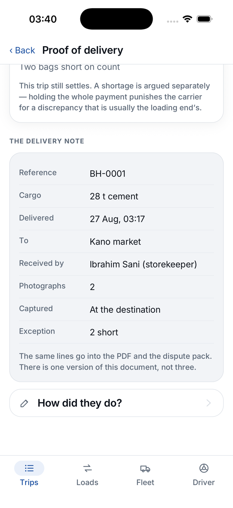 | 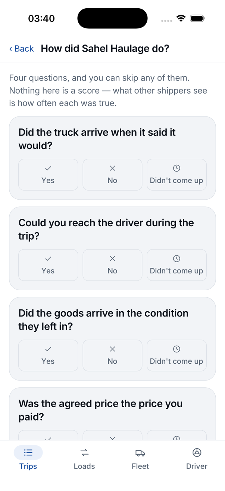 |

The note's lines come from the domain, so the PDF, the dispute pack and the
screen cannot disagree — three renderings that differ is the situation a proof
is supposed to end.

The review is **four facts, not five stars**. A 4.2 compresses "arrived late
twice" and "damaged the load" into one number, and on a two-sided market the
average drifts upward until everyone is 4.8 and it says nothing. What other
shippers see is "6 of 7" — and the denominator is the part that matters, which
is why nothing is shown until three trips have been answered for.

### The fleet owner

| Utilisation and what needs a person | Whose bid to take |
|---|---|
| 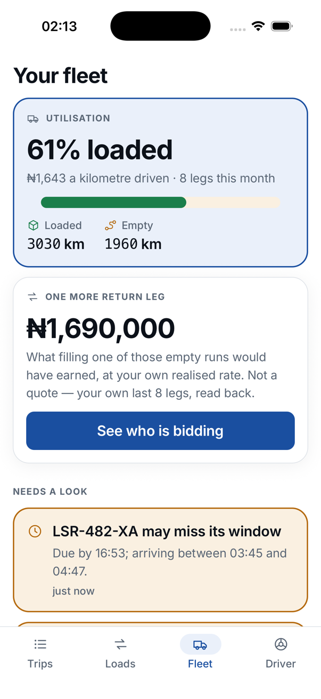 | 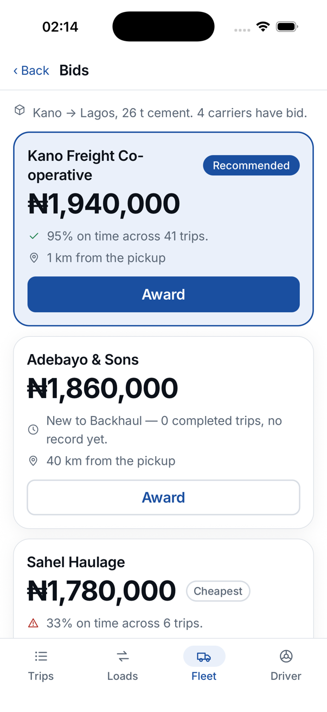 |

Utilisation leads, because it is the number the product exists to move: the
share of kilometres that were paid for, and what one more loaded return leg
would earn *at the fleet's own realised rate*. Not a quote — their last eight
legs, read back.

The bids screen is where the product earns trust or loses it. The recommended
bid on the right is **₦160,000 dearer than the cheapest**, because 95% on time
across 41 trips beats 33% across 6 — and both numbers sit beside both prices,
so a shipper can disagree. A carrier with no history ranks as *unknown*, not as
bad: a marketplace that never surfaces a new carrier never gets a second one.

### The carrier

| The board | Three legs instead of one |
|---|---|
| 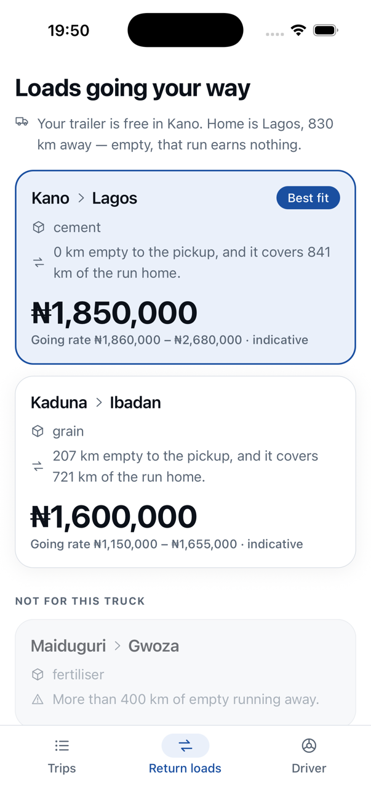 | 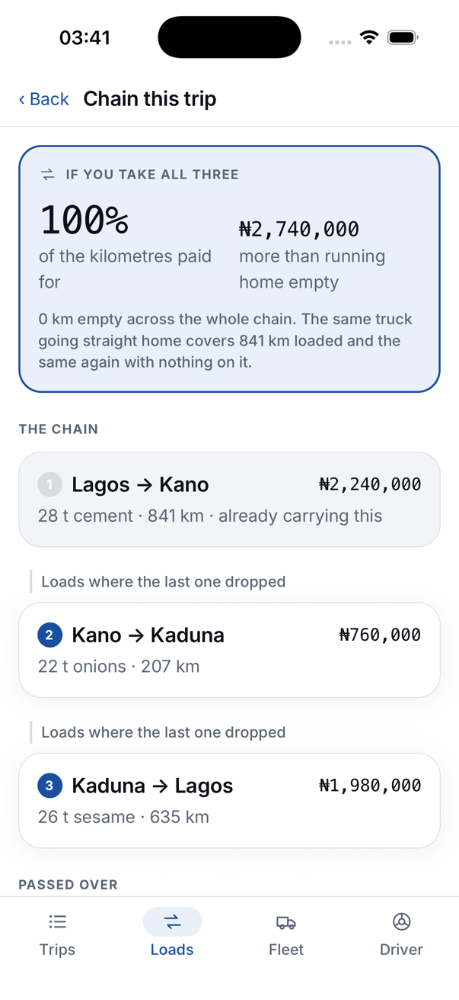 |

Every row says what the load leaves **this** carrier after diesel at today's
price, the running cost of the truck and what the road takes — and it will say
to walk away, with the figure in litres. The going rate is what a shipper
should pay; this is whether to say yes, and they are different questions.

The reason the product is called Backhaul. An empty truck running 830 km home
earns nothing, so a load going that way at ₦1,850,000 beats one going the wrong
way at ₦2,600,000 — and the row says *why*, in empty kilometres and kilometres
of the run home, so a haulier can disagree with it. Loads the truck cannot take
are greyed with the reason rather than hidden.

Chaining is the same argument taken two legs further: Lagos → Kano → Kaduna →
Lagos, loaded the whole way, against the same truck running home empty. The
loads it **passed over** are shown too, each with the reason — either which leg
out-earned it, or the shortest empty reposition that was still too far. A
proposal you cannot argue with is a proposal nobody acts on.

| Sharing a trailer | The runs you make again |
|---|---|
| 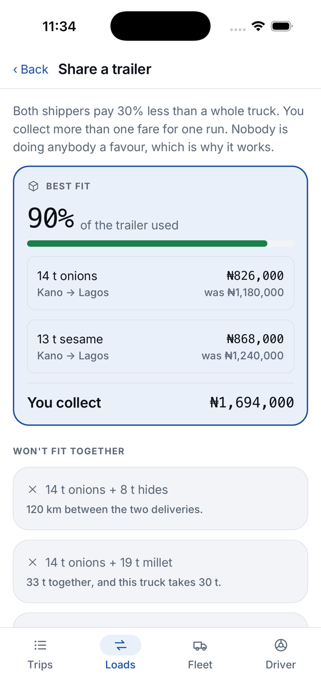 | 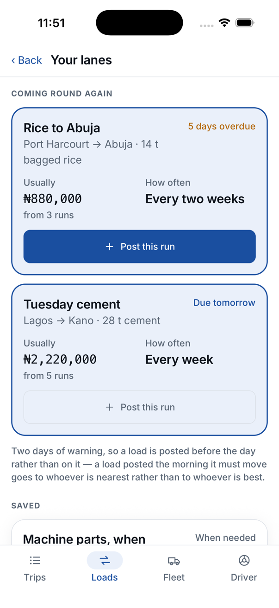 |

A 12-tonne consignment on a 30-tonne trailer pays for the trailer and wastes
eighteen tonnes of it. Two part-loads share the run when the pickups are within
50 km, the deliveries within 80, and the pair actually fills the truck — both
shippers pay 30% less than a whole truck and the carrier collects more than one
fare. The pairs that were **refused** are listed underneath with the reason.

A lane is the same run, named and saved, with what it has actually gone for —
the median of the recent runs, because a mean over two years anchors a shipper
to a number that stopped being true.

| Verification | Trucks and papers |
|---|---|
| 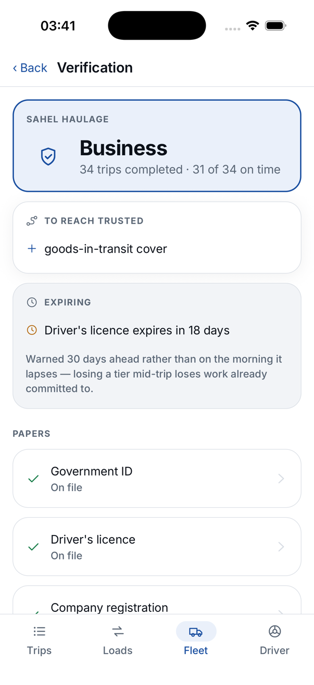 | 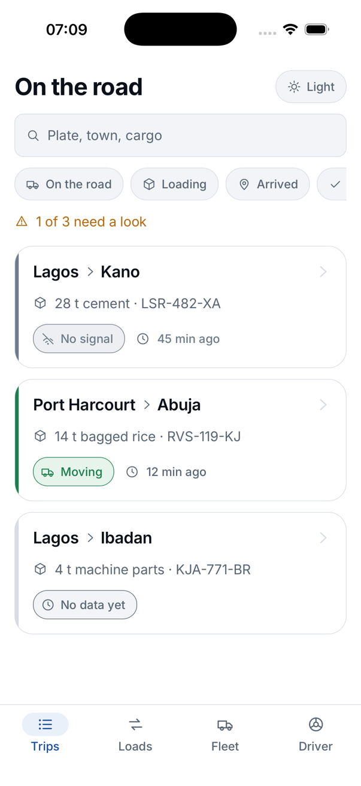 |

`trust.ts` verifies a carrier; `vehicles.ts` verifies the thing that actually
carries the goods. Conflating them is how a Trusted carrier ends up moving
somebody's cargo on a trailer whose roadworthiness lapsed in March. Sorted worst
first, because a fleet list sorted by plate is one nobody scrolls to the bottom
of — and the truck at the bottom is the one with the lapsed certificate.

**A paper that lapses mid-trip never strands a driver.** It blocks the next
assignment instead: the pressure belongs on the office, not on somebody eight
hundred kilometres from home.

A tier is never something a carrier types in: it comes out of documents and a
delivery record neither side can edit. An upheld incident costs **one tier, not
the record** — somebody whose truck was robbed is not thereby untrustworthy, and
a system that treats one bad trip as career-ending is one carriers will lie to.
What is missing between here and the next tier is named exactly, because a
badge with no path to the one above it is a locked door.

### What reaches your phone


Six engines can each produce something worth knowing; **none of them decides
whether to interrupt you**. Exactly one kind of alert overrides quiet hours —
a driver in trouble. Everything else waits until six and arrives as one line,
because four buzzes in a minute reads as a malfunction rather than as a summary.

The hour selector re-runs the real decision for every kind, so the screen shows
the policy rather than describing it.

### The driver

| The trip, and what it costs them | The same screen in Hausa | The checkpoint ledger |
|---|---|---|
| 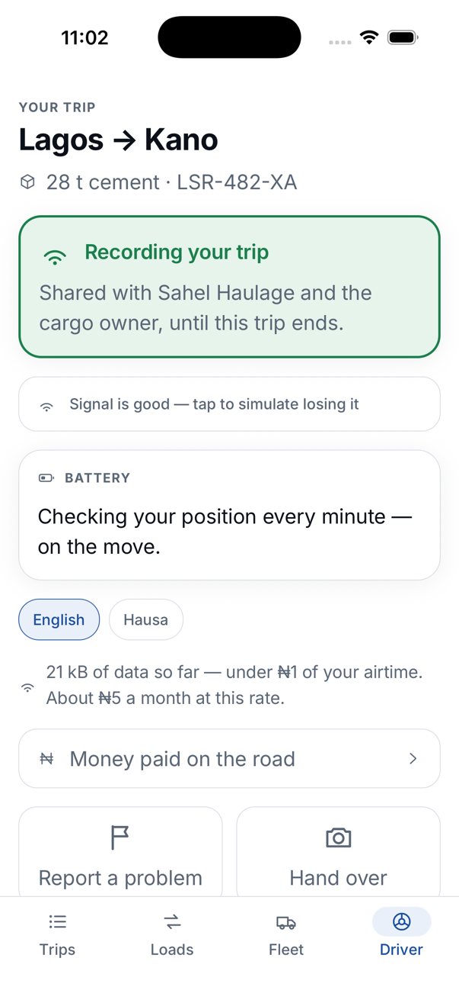 | 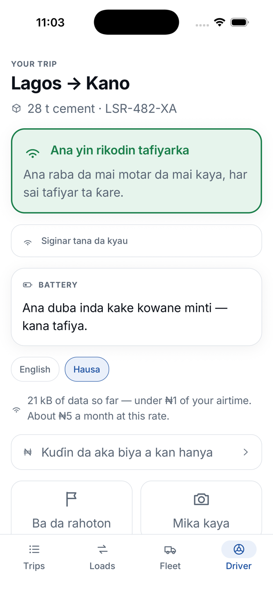 | 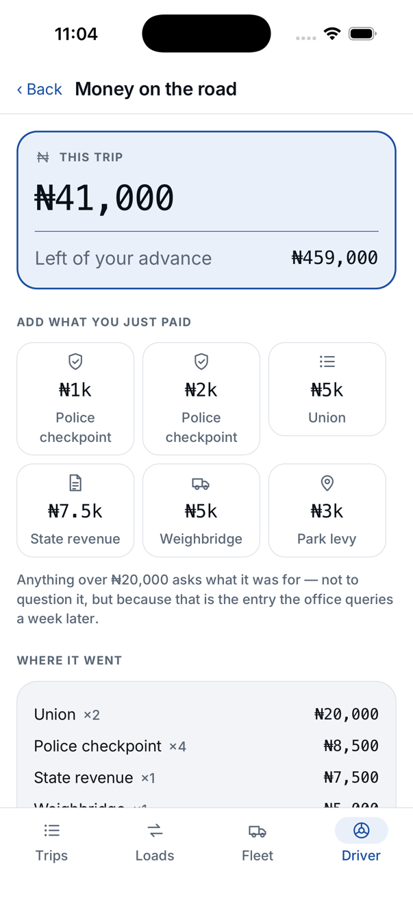 |

Two things a driver has never been told by a tracking app: **what it costs
them**, and **their own language**.

The data figure was built as a warning and turned out to be a reassurance — a
day of recording is about fifteen kobo, and a three-day Lagos–Kano run costs
under a naira. Writing that engine is what established that *battery*, not
data, is the price a driver pays.

Hausa covers the driver face and only the driver face: the tracking card, the
battery line, the buttons and the ledger. The carrier's name is deliberately
dropped from the translated sentence rather than poured into it — word order
differs between the two languages, and a template with a hole in it assumes it
does not.

The ledger is what the road actually takes: police, union, state revenue,
weighbridge, park. One tap per payment, because a driver at a checkpoint has
one hand and thirty seconds. It reconciles against the advance and **goes
negative** when they are out of pocket, which is the common case on a long run
and the number they care about.

There is also a duress alarm, and it is not in these screenshots on purpose:
a long press on the cargo line sends it, and **nothing happens on screen**. No
toast, no sound, no changed state. `visibleConfirmation()` returns null and is
tested, because whoever is standing over the driver must not be able to tell.

| On the road | Arrived | Done |
|---|---|---|
| 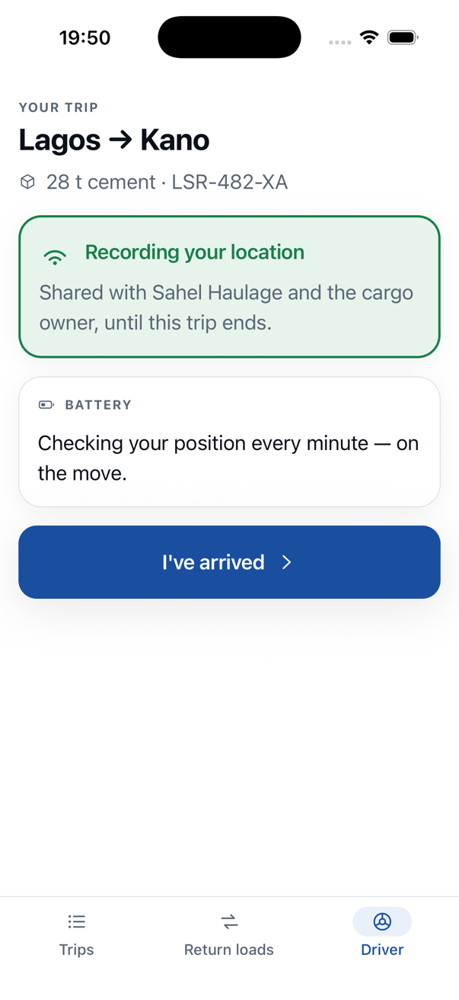 | 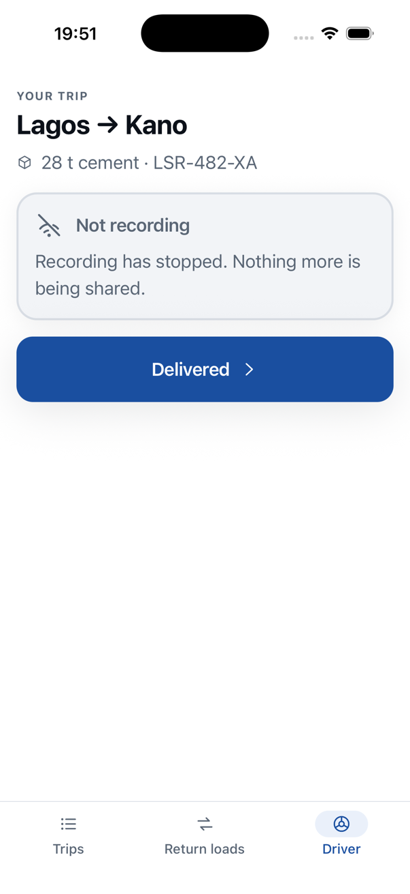 | 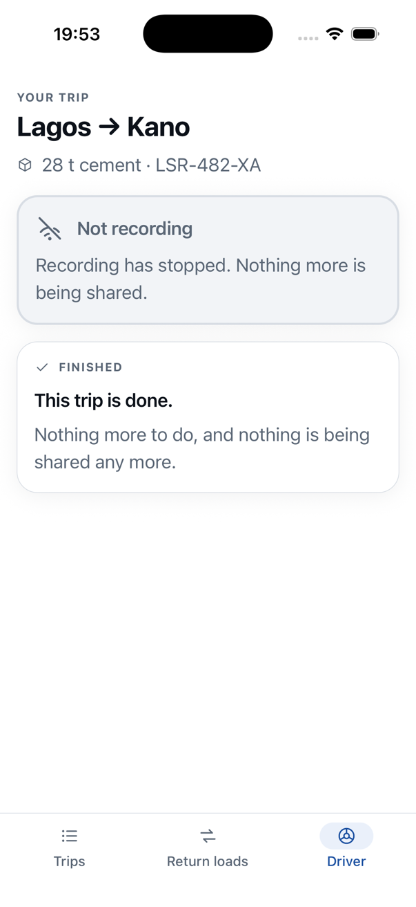 |

One screen, one action, nothing to browse. The two things above the button
answer the only two questions a driver has about tracking software — *what is
it telling people about me*, and *is it costing me my battery* — because a
driver who cannot see why their phone is doing something force-quits the app,
and a force-quit trip is a trip with no evidence.

The button says "I've arrived", not "transition to arrived". And the buttons
offered are only the ones a person can press: `signal_lost` and `stalled` are
raised by the tracker, and offering them would be asking a driver to
self-report the thing the tracking exists to detect.

### Both themes, and both text extremes

| Dark | Largest text |
|---|---|
|  | 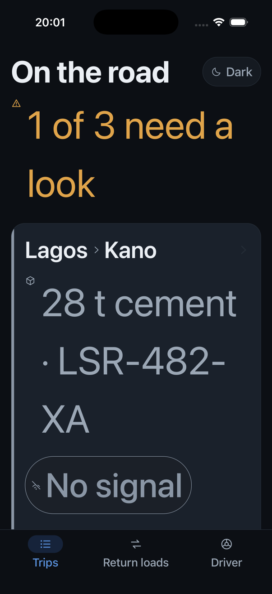 |

| A trip, dark | Return loads, dark |
|---|---|
|  | 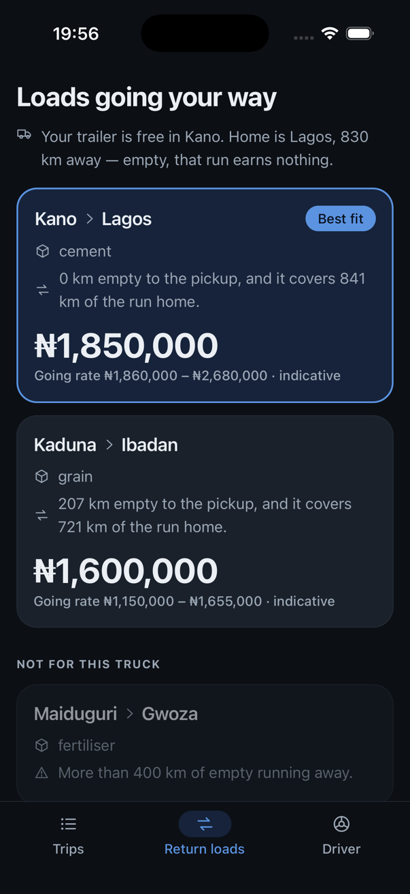 |

| Sharing, dark | Messages, dark |
|---|---|
| 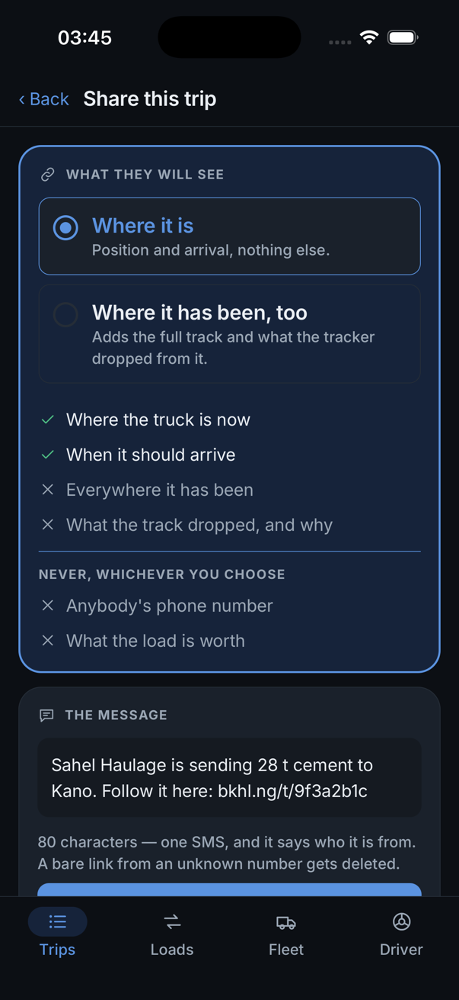 | 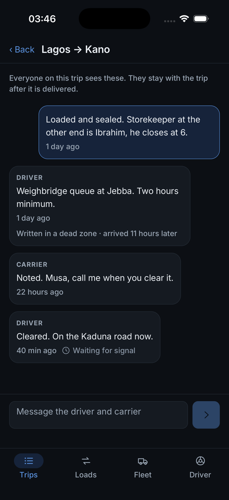 |

The largest text size is checked by looking, not assumed. It has caught four
things a test could not: a header that truncated "Lagos → Kano" to "Lagos →…",
losing the destination; three trip actions that became "Sh…", "M…" and "Re…";
corridor labels broken across three lines; and a search placeholder running off
the edge. Chrome — headers, axis labels, button labels — has its growth capped;
body text does not.

### And Android

| Trips | Driver |
|---|---|
|  | 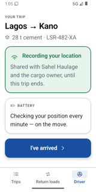 |

One codebase, and the same design system. The emulator is set to 360×800 dp
(720×1600 at xhdpi), which is a Tecno Spark / Infinix Hot — the class of
handset that dominates the driver segment.

It was 320×640 dp until somebody looked at a screenshot and said the type was
too big. It was not: font scale was 1.0 and every size was as designed. The
*screen* was smaller in dp than any phone on sale, so the same type filled more
of it — and calling that "a useful proxy for a low-end handset" had it exactly
backwards. A stress test below the floor is worth running; it is not worth
photographing and calling representative.

| Choosing a language | The loop, running, and blocked |
|---|---|
| 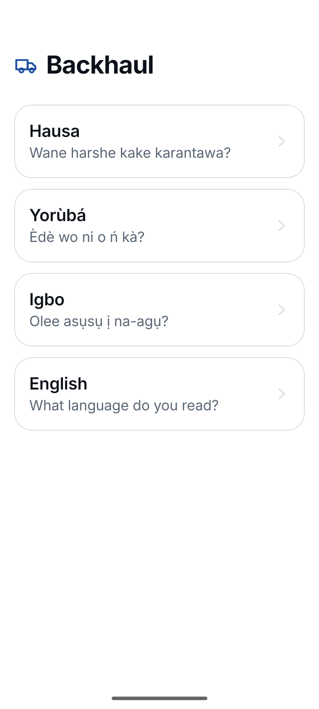 | 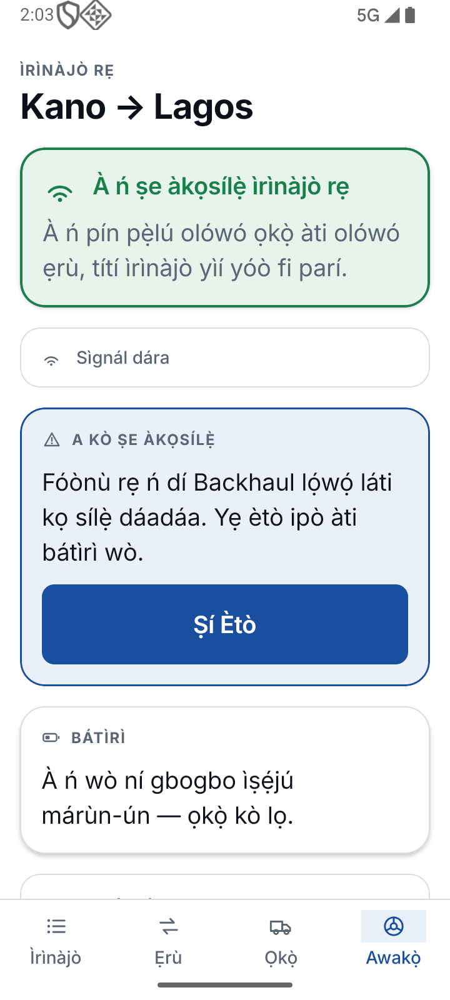 |

The right-hand screen is the capture loop live on Android: a real trip, the
consent card that says who can see the driver, and — because this emulator's
location provider is throttled — the card that says the *phone* is stopping the
recording, with the way to fix it on the same card. That last one matters more
than it looks: on a Transsion handset an OEM battery manager killing a
foreground service is the difference between a trip that records and one that
quietly does not, and the app's own log is the last place anybody looks. See
[ADR-0002](docs/adr/0002-the-tracking-loop-does-not-live-in-javascript.md).

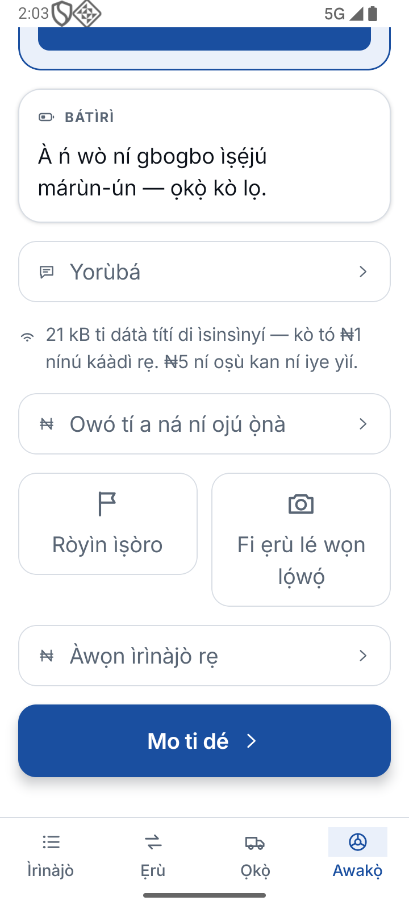

The icon in an Android launcher, masked to whatever shape the OEM ships:

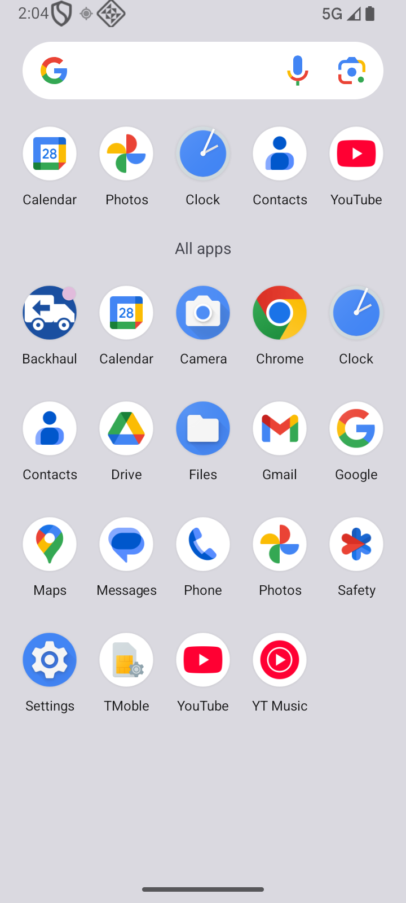

#### Asking for what the loop needs

| Notifications first | Then location | And if the answer is no |
|---|---|---|
| 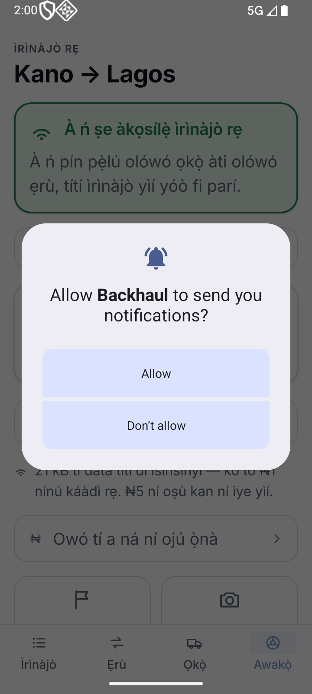 | 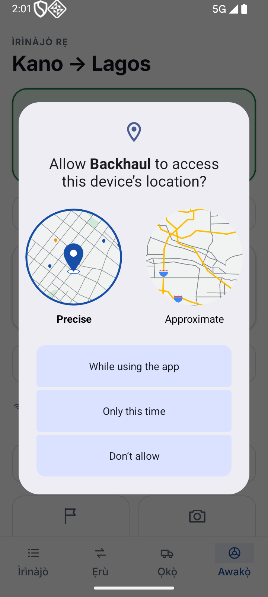 | 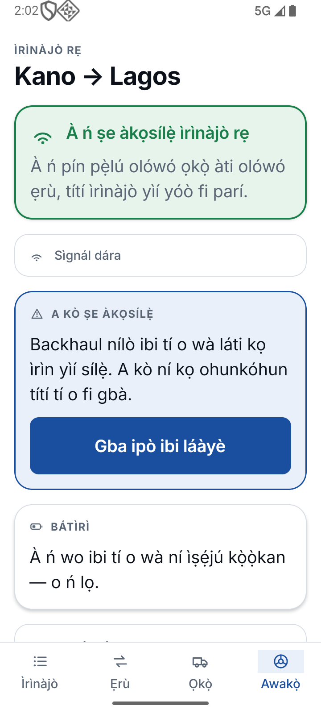 |

**The order is the point.** On Android 13+ the notification permission has to be
granted before the foreground service starts, or the service's notification is
silently dropped — and on several OEM builds a foreground service with no
visible notification is grounds for killing it. Notifications are asked for
first and are *not* required: a driver who refuses one still gets a recorded
trip, and `canTrack` says so.

Location is. The third screen is what a driver sees when they say no: not
"permission denied", but that their trip is not being recorded and the button
that fixes it, in the language they chose. Blocked and denied are different
screens, because "never ask again" has only one way forward and it is Settings
— a screen that treats them alike shows a button that does nothing, twice.

Signing in is the same four languages on both platforms:

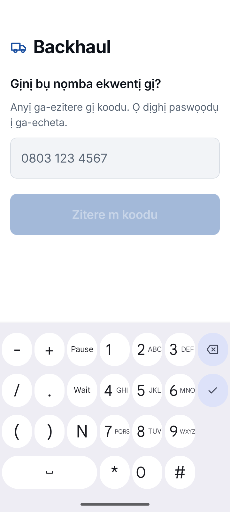

The Android build needed three corrections React Native's own scaffolding does
not make for a workspace, all recorded in
[`docs/TOOLCHAIN.md`](docs/TOOLCHAIN.md): the Gradle paths assume no monorepo,
`compileSdkVersion` names a platform that has not shipped, and `avdmanager`
resolves its SDK from its own directory rather than `ANDROID_HOME`.

**Light by default**, with a labelled control to switch — see
[ADR-0007](docs/adr/0007-light-is-the-default-and-the-choice-is-the-users.md).
This is read in Nigerian daylight far more often than in the dark, and a
handset set to dark months ago should not decide that for a driver at noon.

The right-hand shot is iOS at its largest accessibility text size. Nothing
truncates, the tab bar holds, and display type is capped while body text scales
without limit — body is what a low-vision user needs bigger; a 36 pt hero at
310% is 112 pt and fills a screen. It was broken the first time anybody looked,
which is why the screenshot is in this README rather than a claim that it works.

---

## 4. How it fits together

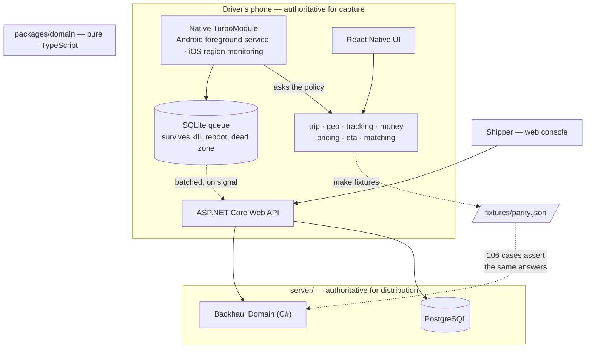
```mermaid
graph TB
    subgraph device["Driver's phone — authoritative for capture"]
        native["Native TurboModule<br/>Android foreground service · iOS region monitoring"]
        queue[("SQLite queue<br/>survives kill, reboot, dead zone")]
        rn["React Native UI"]
        native --> queue
        queue -.->|"batched, on signal"| api
        rn --> domain1
    end

    subgraph shared["packages/domain — pure TypeScript"]
        domain1["trip · geo · tracking · money<br/>pricing · eta · matching"]
    end

    subgraph server["server/ — authoritative for distribution"]
        api["ASP.NET Core Web API"]
        csharp["Backhaul.Domain (C#)"]
        db[("PostgreSQL")]
        api --> csharp
        api --> db
    end

    domain1 -.->|"make fixtures"| fixtures[/"fixtures/parity.json"/]
    fixtures -.->|"106 cases assert<br/>the same answers"| csharp

    native -->|"asks the policy"| domain1

    shipper["Shipper — web console"] --> api
```

**The device is authoritative for capturing and preserving a position; the
server is authoritative for distributing it.** A truck driving through 400 km
of dead zone loses nothing — the samples are on the phone, in order, and they
arrive complete when signal returns.

---

## 5. The trip

The state machine is written as **data, not control flow** — an explicit edge
set that a test asserts exactly, so adding a transition fails the build rather
than quietly permitting a new way for cargo to change hands.

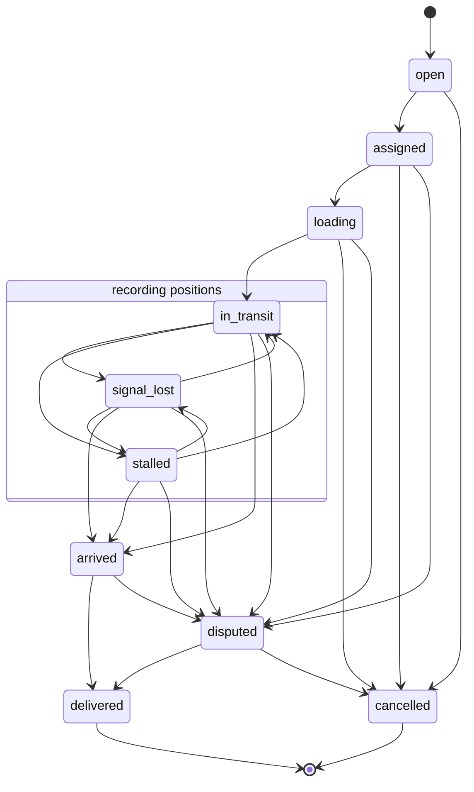
```mermaid
stateDiagram-v2
    [*] --> open
    open --> assigned
    open --> cancelled
    assigned --> loading
    assigned --> cancelled
    assigned --> disputed
    loading --> in_transit
    loading --> cancelled
    loading --> disputed

    state "recording positions" as recording {
        in_transit --> signal_lost
        in_transit --> stalled
        signal_lost --> in_transit
        signal_lost --> stalled
        stalled --> in_transit
        stalled --> signal_lost
    }

    in_transit --> arrived
    signal_lost --> arrived
    stalled --> arrived
    in_transit --> disputed
    signal_lost --> disputed
    stalled --> disputed

    arrived --> delivered
    arrived --> disputed
    disputed --> delivered
    disputed --> cancelled

    delivered --> [*]
    cancelled --> [*]
```

Three things in that diagram are deliberate and easy to get wrong:

- **The three transit states move freely between one another.** Signal and
  movement come and go on a Lagos–Kano corridor several times a trip, and each
  drop must not need a human to un-stick it.
- **`signal_lost` still records.** Stopping capture when the network drops
  loses precisely the stretch of road nobody can account for afterwards.
- **A dispute never returns to the road.** Resolution is a human decision
  recorded as an event, never inferred from tracking data — the reason a trip
  is disputed is that the tracking data is being argued about. A resumed trip
  is a new trip.

The history is **append-only**. No update path, no delete path; a correction is
a new event and the original survives (ADR-0003).

---

## 6. The ingest path

The one endpoint with a contract that cannot be relaxed.

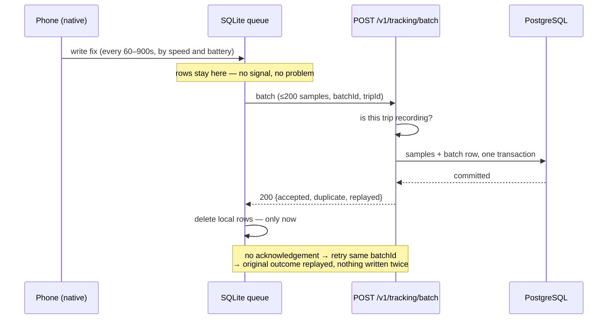
```mermaid
sequenceDiagram
    participant P as Phone (native)
    participant Q as SQLite queue
    participant A as POST /v1/tracking/batch
    participant D as PostgreSQL

    P->>Q: write fix (every 60–900s, by speed and battery)
    Note over Q: rows stay here — no signal, no problem

    Q->>A: batch (≤200 samples, batchId, tripId)
    A->>A: is this trip recording?
    A->>D: samples + batch row, one transaction
    D-->>A: committed
    A-->>Q: 200 {accepted, duplicate, replayed}
    Q->>Q: delete local rows — only now

    Note over Q,A: no acknowledgement → retry same batchId<br/>→ original outcome replayed, nothing written twice
```

- **Acknowledges only once committed, never optimistically.** The device
  deletes its local rows on that acknowledgement and on nothing else. Making
  this endpoint faster by responding earlier does not make it faster; it makes
  it destroy the evidence the product exists to keep.
- **The batch row and the samples commit together.** Written separately, a
  crash between them acknowledges a batch whose samples were never stored.
- **Duplicate delivery is expected**, not exceptional. Samples deduplicate on
  their client-generated id, which is the primary key, so a repeat is a no-op
  by construction.
- **Samples are stored exactly as sent.** Fixes the phone could not vouch for
  are excluded when a track is *read*, where what was excluded is shown beside
  the figure it was excluded from. A server that quietly discards fixes
  destroys the evidence a driver needs to argue with their invoice.
- **There is no off-trip tracking.** The server rejects samples for a trip that
  is not under way rather than trusting the client not to send them.

Verified rather than asserted: an acknowledged batch, its trip and its history
survive a process restart against real PostgreSQL, and replaying that batch
afterwards returns the original outcome and writes nothing.

---

## 7. Two languages, one set of answers

The server is .NET; the domain is TypeScript. Every rule that exists on both
sides therefore exists **twice**, and two implementations of a demurrage rule
is two answers to give a shipper.

`packages/domain` is the source of truth. `make fixtures` regenerates
`fixtures/parity.json` from it, and the C# suite asserts the same answers:

| Covered | Cases |
|---|---|
| Trip machine — complete edge set, terminal and tracking flags | 24 transitions, 10 states |
| Refusal messages, **word for word** | 5 |
| Time-in-state arithmetic | 3 |
| Quotes across four real corridors × five truck classes | 20 |
| Demurrage, including boundary minutes | 30 |
| Settlement, on deliberately awkward figures | 7 |
| Percentage rounding, both signs | 10 |
| Truck classing at capacity boundaries | 11 |
| Haversine distances between real cities | 10 |
| Track cleaning outcomes | 5 |
| Stall and silence detection | 7 |

`make fixtures-check` fails the build on stale fixtures, so forgetting to
regenerate surfaces as *"you forgot a step"* rather than *"the server is
broken"*. Full argument: [ADR-0005](docs/adr/0005-the-server-is-dotnet-and-parity-is-a-test.md).

### And the wire formats, which fixtures cannot check

Fixtures hold the two *domains* to the same answers. Nothing was holding the
two *serialisers* to each other — and the last time these two spoke different
spellings of the same instant, it took a fixture comparing refusal wording to
notice.

`make round-trip` drives the running server through the app's own client and
demands they agree:

```
ok    an illegal transition is refused
ok    the refusal carries the sentence, not a status line
ok    timestamps survive the round trip exactly
ok    the same batch replays rather than writing twice
ok    the tower fix was excluded
ok    the server and the app clean the track identically
ok    and agree on the distance, to the metre
ok    and on what the truck is doing
```

The last three run the same position fixes through the TypeScript domain and
compare against what the C# server returned — the whole stack, end to end, on
one set of numbers.

---

## 8. Correctness notes

The defects worth recording are the ones a green test suite did not catch.

**Pricing was wrong by a factor of five, and only a real route showed it.**
Rates were per tonne-kilometre — how freight is costed in most of the world,
and not how anybody in Nigerian haulage talks. The arithmetic was clean, the
tests were green, and it quoted **₦398,400 for a Lagos–Kano trailer run** that
goes for something over two million naira. What caught it was a test asserting
a range *a haulier would recognise*, against a real 830 km corridor, rather
than a range the formula would produce.

**Bid ranking handed every load to the cheapest bidder.** Price was scored by
position within the spread of bids received, so with two bids of ₦1,800,000 and
₦2,000,000 the dearer scored *zero* — as though infinitely expensive — because
it happened to top a two-bid range. A carrier with 2 on-time trips out of 6
beat one with 39 out of 40, which is the exact failure the ranking exists to
prevent. Now a proportional premium over the cheapest.

**A dropped fix used to take the rest of the leg with it.** The cleaner
rejected a cell-tower fix that snapped 800 km across the country, then compared
the *next* good fix against the bad one, decided that was an implausible jump
too, and kept going. A rejected fix is no longer the baseline for the next.

**A parked truck can drift into movement.** Two fixes of a stationary truck,
each accurate to ±90 m, sit 180 m apart. Counted as travel, an overnight stop
invents kilometres onto a per-kilometre rate. Movement now has to clear the
combined uncertainty of both fixes.

**The two implementations disagreed on a timestamp.** TypeScript writes
`2026-03-04T06:20:00.000Z`; .NET's round-trip format writes
`2026-03-04T06:20:00.0000000+00:00`. Both parse, both are ISO 8601, and a
driver would have seen a different sentence depending on which system answered.
Caught by the parity fixture comparing refusal wording character for character
— which felt excessive when it was written. The same bug was then found in
every response body, **by reading a response rather than by a test.**

**A Swagger annotation was lying.** An endpoint documented as returning 200
actually returned 201. Nothing was broken; the generated contract was simply
wrong about the API it described, which is worse than no contract because it is
trusted.

---

## 9. Running it

```bash
make setup          # install
make ci             # everything: gates, domain, app and server tests
```

The app, on the iOS simulator:

```bash
make app-pods       # CocoaPods, with the locale it needs
make app-ios
```

The server, on an in-memory store — no database needed, Swagger at `/swagger`:

```bash
make server-run
```

Against real PostgreSQL, in Docker:

```bash
make server-up      # http://localhost:8080/swagger
make server-down    # and drop its scratch database
```

The .NET SDK is installed per-user at `~/.dotnet` and is not on a default
PATH; the Makefile's `DOTNET` variable points at it and is overridable for CI.

---

## 10. The gates

`make gates` runs the blocking checks. Three of them exist because something
was missed, not in anticipation of it:

| Gate | Catches |
|---|---|
| `make typecheck` | TypeScript, strict, with `noUncheckedIndexedAccess` and `exactOptionalPropertyTypes` |
| `make lint` | The domain purity boundary, and reading the clock |
| `make boundary` | **The purity rule having silently stopped matching** — injects a violation and fails if lint stays quiet |
| `make doc-check` | A required document missing, malformed, **or present on disk and untracked by git** |
| `make fixtures-check` | **Fixtures stale after a rule changed on the TypeScript side** |
| `make app-typecheck` | The app, under the same strict settings as the domain |
| `make server-test` | 106 parity cases, 16 endpoint tests |
| `make round-trip` | The app's client and the real server disagreeing about the wire format |
| `make server-test` (auth) | A caller reading a trip they are not on, or writing positions to one they only watch |

The doc gate's git-tracked check exists because a sibling project had a
document written, committed with a message saying so, and absent from GitHub
for a day — `docs/*` is an allow-list and `git add` had nothing to add.

---

## 11. What is deliberately missing

- **Phone-plus-OTP sign-in.** Tokens exist, are checked, and gate every
  endpoint; what does not exist is a way for a user to *obtain* one without
  somebody running a command. There is no SMS provider, and a fake login flow
  is worse than an honest command. Phase 3.
- **Verification tiers and rate limiting.** Both in the backend spec, neither
  built. Rate limiting belongs with a reverse proxy rather than in the
  application.
- **A real map.** The shipper sees a corridor drawn to scale, not tiles. That
  is deliberate for phase 0 and pinned to phase 2's exit gate rather than to
  anyone's judgement about whether it still feels sufficient — see ADR-0006.
- **Android on real hardware.** The app builds for Android; the definition of
  done requires a physical Transsion handset — a Tecno or an Infinix — which is
  where the battery and OEM-kill risks actually live, and no emulator stands in
  for them.
- **Corridor-segmented ETA.** What exists is the fallback tier — pace from the
  trip's own track, or a class average, marked as modelled either way. The
  empirical model needs a corpus of completed trips; building it now would
  produce a model fitted to nothing, dressed in the authority of a
  distribution. See [`docs/FEATURE-BACKLOG.md`](docs/FEATURE-BACKLOG.md).
- **The marketplace.** Loads, bids and awards. The ranking engines are written
  and tested; nothing surfaces them.
- **PostGIS.** In the compose image, unused. The first geometry column arrives
  with load search in phase 5.
- **Bulk ingest.** Samples insert row by row. The Redis buffer and bulk `COPY`
  in the backend spec matter at ~850,000 samples a day; at pilot volume they
  would be a premature complication.

---

## 12. Documents

| Document | Answers |
|---|---|
| [`docs/00-PRODUCT-STATEMENT.md`](docs/00-PRODUCT-STATEMENT.md) | Why this exists |
| [`docs/ROADMAP.md`](docs/ROADMAP.md) | Where the work is, and what finishes each phase |
| [`docs/JOURNAL.md`](docs/JOURNAL.md) | What we did, and what surprised us |
| [`docs/adr/`](docs/adr/) | Why it is built this way |
| [`docs/FEATURE-BACKLOG.md`](docs/FEATURE-BACKLOG.md) | What is missing, why, and what would unblock it |
| [`CHANGELOG.md`](CHANGELOG.md) | What changed for someone using this |
| [`CLAUDE.md`](CLAUDE.md) | How to work in this repository |
| [`DESIGN.md`](DESIGN.md) | Colour, type, targets, voice |
| [`server/README.md`](server/README.md) | The API in detail |
| [`docs/TOOLCHAIN.md`](docs/TOOLCHAIN.md) | What to install, and what goes wrong installing it |
